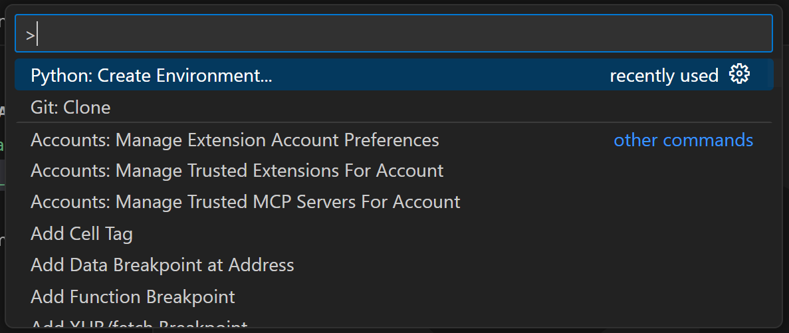
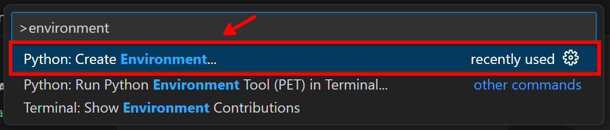
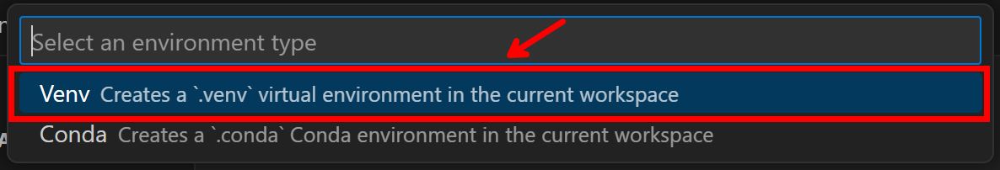
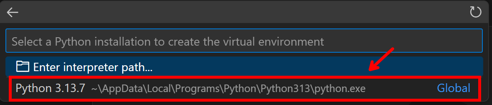
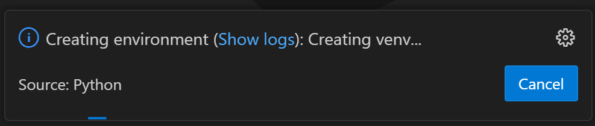
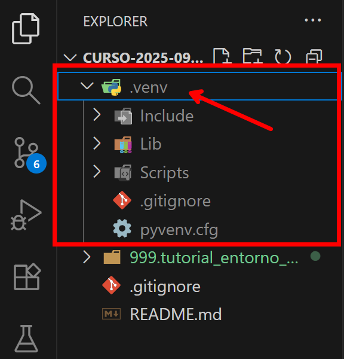

## CÓMO CREAR UN ENTORNO VIRTUAL EN VISUAL STUDIO CODE

1. Abrir la Paleta de comandos con `Control+Shift+P`.

2. Escribir "environment" o "ambiente" dependiendo si está el VSCode en inglés o en español y hacer click en "Python: Create Environment" o "Python: Crear Ambiente".

3. Seleccionar el tipo de environment. Para este repositorio utilizaremos `Venv`.

4. Seleccionar la versión de Python. Para este repositorio utilizaremos `Python 1.13.7`.

5. Se empezará a crear el entorno virtual

6. Comprobamos que se ha creado la carpeta `.venv`

