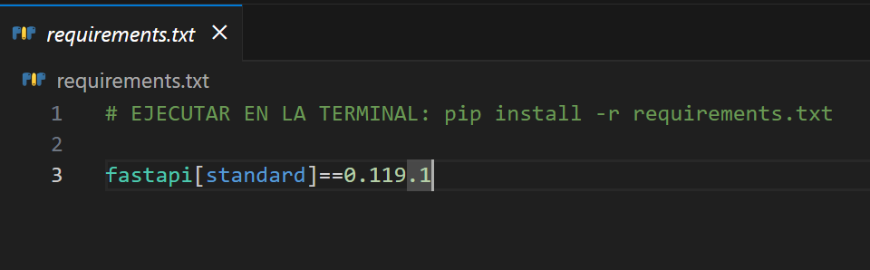
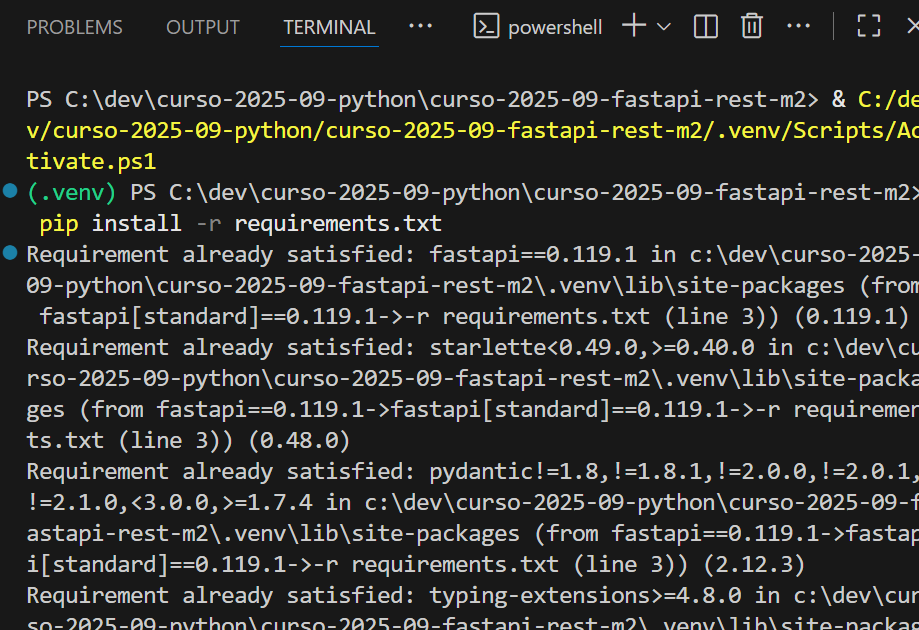

## CÓMO CREAR UN ENTORNO VIRTUAL EN VISUAL STUDIO CODE

1. Abrir la Paleta de comandos con `Control+Shift+P`.

2. Escribir "environment" o "ambiente" dependiendo si está el VSCode en inglés o en español y hacer click en "Python: Create Environment" o "Python: Crear Ambiente".

3. Seleccionar el tipo de environment. Para este repositorio utilizaremos `Venv`.

4. Seleccionar la versión de Python. Para este repositorio utilizaremos `Python 1.13.7`.

5. Se empezará a crear el entorno virtual

6. Comprobamos que se ha creado la carpeta `.venv`

7. Crear el archivo `requirements.txt` en la misma ruta donde se ha creado la carpeta `.venv` (en este caso, la ruta raíz) y escribir las tecnologías que se van a usar con su versión correspondiente

8. Instalar las dependencias ejecutando en la terminal el comando `pip install -r requirements.txt`

## BORRAR E INSTALAR DE NUEVO EL ENTORNO VIRTUAL

1. Borrar la carpeta .venv
 
2. Crear un nuevo entorno virtual
En la terminal integrada de VS Code:
`python -m venv .venv`.
Esto creará una nueva carpeta .venv dentro del proyecto.

3. Activar el nuevo entorno. Luego actívalo:
`.\.venv\Scripts\activate`

4. Instalar dependencias instálalas con: `pip install -r requirements.txt`

5. (Opcional) Configurar VS Code para usar el nuevo entorno
* Pulsa `Ctrl + Shift + P `
* Escribe "Python: Select Interpreter"
* Elige el que diga algo como: `.venv\Scripts\python.exe`