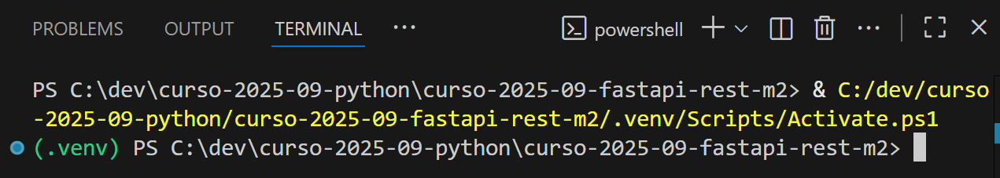

## CÓMO SOLUCIONAR ERROR EN LA TERMINAL

1. Abrir Windows PowerShell escribiendo "Powershell" en la barra de búsqueda de Windows o hacer click derecho en el icono de Windows de la Barra de herramientas y hacer click en `Terminal`

2. Ejecutar el comando `Set-ExecutionPolicy -ExecutionPolicy RemoteSigned -Scope CurrentUser`

3. El error debería haberse solucionado y aparecer la terminal como:

