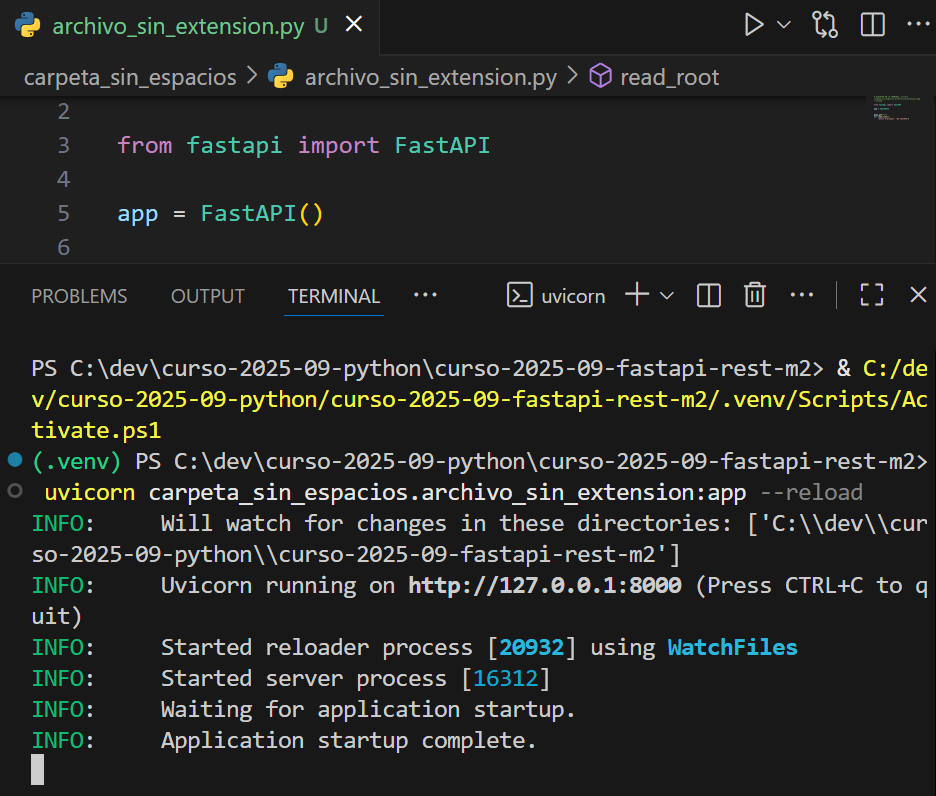
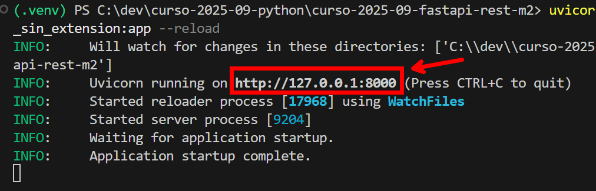
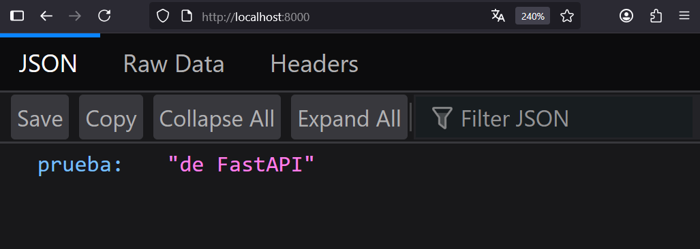

## EJECUTAR FASTAPI

1. Nos aseguramos que ninguna carpeta ni archivo tengan espacios o caracteres extraños. Usar barras bajas en lugar de espacios.

2. Ejecutamos en la terminal el comando `uvicorn carpeta.archivo:app --reload`

3. Abrir el enlace que aparece `http://127.0.0.1:8000` o abrir `http://localhost:8000/`

4. Comprobar que funciona correctamente en el navegador

